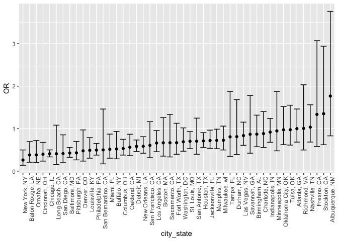
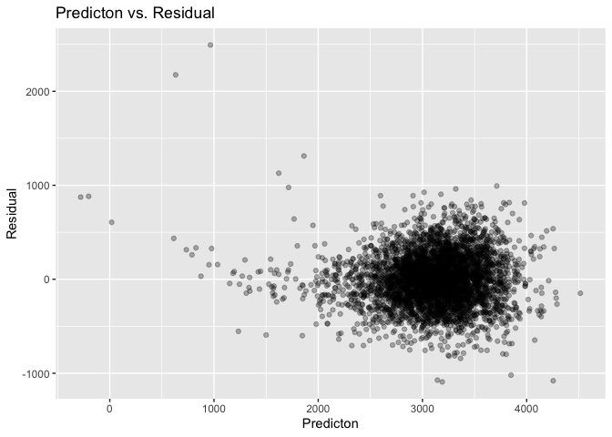
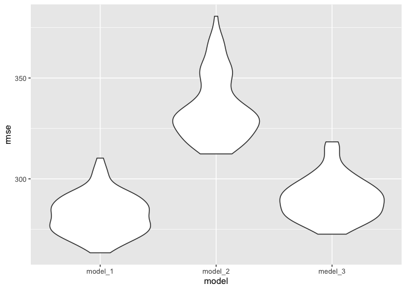
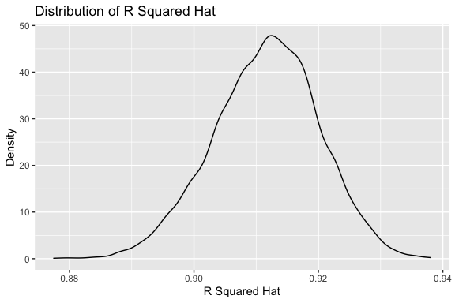
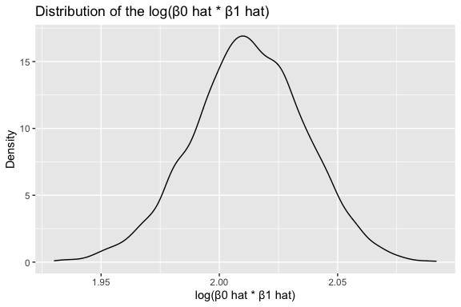

Homework 6
================
Beibei Cao
2020-12-07

## Problem 1

``` r
homicide_df = 
  read_csv("data/homicide-data.csv", na = c("", "NA", "Unknown")) %>% 
  mutate(
    city_state = str_c(city, state, sep = ", "),
    victim_age = as.numeric(victim_age),
    resolution = case_when(
      disposition == "Closed without arrest" ~ 0,
      disposition == "Open/No arrest"        ~ 0,
      disposition == "Closed by arrest"      ~ 1)
  ) %>% 
  filter(
    victim_race %in% c("White", "Black"),
    city_state != "Tulsa, AL") %>% 
  select(city_state, resolution, victim_age, victim_race, victim_sex)
```

Start with one city.

``` r
baltimore_df =
  homicide_df %>% 
  filter(city_state == "Baltimore, MD")

glm(resolution ~ victim_age + victim_race + victim_sex, 
    data = baltimore_df,
    family = binomial()) %>% 
  broom::tidy() %>% 
  mutate(
    OR = exp(estimate),
    CI_lower = exp(estimate - 1.96 * std.error),
    CI_upper = exp(estimate + 1.96 * std.error)
  ) %>% 
  select(term, OR, starts_with("CI")) %>% 
  knitr::kable(digits = 3)
```

| term              |    OR | CI\_lower | CI\_upper |
| :---------------- | ----: | --------: | --------: |
| (Intercept)       | 1.363 |     0.975 |     1.907 |
| victim\_age       | 0.993 |     0.987 |     1.000 |
| victim\_raceWhite | 2.320 |     1.648 |     3.268 |
| victim\_sexMale   | 0.426 |     0.325 |     0.558 |

Try this across cities.

``` r
models_results_df = 
  homicide_df %>% 
  nest(data = -city_state) %>% 
  mutate(
    models = 
      map(.x = data, ~glm(resolution ~ victim_age + victim_race + victim_sex, data = .x, family = binomial())),
    results = map(models, broom::tidy)
  ) %>% 
  select(city_state, results) %>% 
  unnest(results) %>% 
  mutate(
    OR = exp(estimate),
    CI_lower = exp(estimate - 1.96 * std.error),
    CI_upper = exp(estimate + 1.96 * std.error)
  ) %>% 
  select(city_state, term, OR, starts_with("CI")) 
```

``` r
models_results_df %>% 
  filter(term == "victim_sexMale") %>% 
  mutate(city_state = fct_reorder(city_state, OR)) %>% 
  ggplot(aes(x = city_state, y = OR)) + 
  geom_point() + 
  geom_errorbar(aes(ymin = CI_lower, ymax = CI_upper)) + 
  theme(axis.text.x = element_text(angle = 90, hjust = 1))
```

<!-- -->

## Problem 2

Load and clean data.

``` r
baby_df = 
  read_csv("./data/birthweight.csv") %>% 
  janitor::clean_names() %>%
  filter(frace != 9 & mrace != 8) %>% 
  drop_na() %>% 
  mutate(
    babysex = case_when(
      babysex == 1 ~ "male",
      babysex == 2 ~ "female"
    ),
    frace = case_when(
      frace == 1 ~ "White",
      frace == 2 ~ "Black",
      frace == 3 ~ "Asian",
      frace == 4 ~ "Puerto Rican",
      frace == 8 ~ "Other"
    ),
    mrace = case_when(
      mrace == 1 ~ "White",
      mrace == 2 ~ "Black",
      mrace == 3 ~ "Asian",
      mrace == 4 ~ "Puerto Rican",
      mrace == 8 ~ "Other"
    ),
    malform = case_when(
      malform == 0 ~ "absent",
      malform == 1 ~ "present"
    ),
    across(where(is.character), as.factor)
    )
```

#### Modeling

###### Model 1: proposed model

Fit multiple linear regression with all variables available.

``` r
# fit all variables
mul_fit = lm(bwt ~ ., data = baby_df)
summary(mul_fit)
```

    ## 
    ## Call:
    ## lm(formula = bwt ~ ., data = baby_df)
    ## 
    ## Residuals:
    ##      Min       1Q   Median       3Q      Max 
    ## -1097.68  -184.86    -3.33   173.09  2344.15 
    ## 
    ## Coefficients: (3 not defined because of singularities)
    ##                     Estimate Std. Error t value Pr(>|t|)    
    ## (Intercept)       -6306.8346   659.2640  -9.566  < 2e-16 ***
    ## babysexmale         -28.7073     8.4652  -3.391 0.000702 ***
    ## bhead               130.7781     3.4523  37.881  < 2e-16 ***
    ## blength              74.9536     2.0217  37.075  < 2e-16 ***
    ## delwt                 4.1007     0.3948  10.386  < 2e-16 ***
    ## fincome               0.2898     0.1795   1.614 0.106551    
    ## fraceBlack           -6.9048    78.8349  -0.088 0.930210    
    ## fraceOther          -16.9392    97.5932  -0.174 0.862212    
    ## fracePuerto Rican   -68.2323    78.4692  -0.870 0.384599    
    ## fraceWhite          -21.2361    69.2960  -0.306 0.759273    
    ## gaweeks              11.5494     1.4654   7.882 4.06e-15 ***
    ## malformpresent        9.7650    70.6259   0.138 0.890039    
    ## menarche             -3.5508     2.8951  -1.226 0.220083    
    ## mheight               9.7874    10.3116   0.949 0.342588    
    ## momage                0.7593     1.2221   0.621 0.534418    
    ## mraceBlack          -60.0488    80.9532  -0.742 0.458266    
    ## mracePuerto Rican    34.9079    80.9481   0.431 0.666317    
    ## mraceWhite           91.3866    71.9190   1.271 0.203908    
    ## parity               95.5411    40.4793   2.360 0.018307 *  
    ## pnumlbw                   NA         NA      NA       NA    
    ## pnumsga                   NA         NA      NA       NA    
    ## ppbmi                 4.3538    14.8913   0.292 0.770017    
    ## ppwt                 -3.4716     2.6121  -1.329 0.183913    
    ## smoken               -4.8544     0.5871  -8.269  < 2e-16 ***
    ## wtgain                    NA         NA      NA       NA    
    ## ---
    ## Signif. codes:  0 '***' 0.001 '**' 0.01 '*' 0.05 '.' 0.1 ' ' 1
    ## 
    ## Residual standard error: 272.5 on 4320 degrees of freedom
    ## Multiple R-squared:  0.7183, Adjusted R-squared:  0.717 
    ## F-statistic: 524.6 on 21 and 4320 DF,  p-value: < 2.2e-16

Apply step-wide backward method to select variables based on lowest AIC
values.

``` r
# step-wide backward method (the output is very long so commented)
# step(mul_fit, direction = "backward") 

# this is the last call of the `step()` method
last_call = lm(formula = bwt ~ babysex + bhead + blength + delwt + fincome + 
    gaweeks + mheight + mrace + parity + ppwt + smoken, data = baby_df)

# check how it fits
summary(last_call)
```

    ## 
    ## Call:
    ## lm(formula = bwt ~ babysex + bhead + blength + delwt + fincome + 
    ##     gaweeks + mheight + mrace + parity + ppwt + smoken, data = baby_df)
    ## 
    ## Residuals:
    ##      Min       1Q   Median       3Q      Max 
    ## -1097.18  -185.52    -3.39   174.14  2353.44 
    ## 
    ## Coefficients:
    ##                     Estimate Std. Error t value Pr(>|t|)    
    ## (Intercept)       -6145.1507   141.9496 -43.291  < 2e-16 ***
    ## babysexmale         -28.5580     8.4549  -3.378 0.000737 ***
    ## bhead               130.7770     3.4466  37.944  < 2e-16 ***
    ## blength              74.9471     2.0190  37.120  < 2e-16 ***
    ## delwt                 4.1067     0.3921  10.475  < 2e-16 ***
    ## fincome               0.3180     0.1747   1.820 0.068844 .  
    ## gaweeks              11.5925     1.4621   7.929 2.79e-15 ***
    ## mheight               6.5940     1.7849   3.694 0.000223 ***
    ## mraceBlack          -63.9057    42.3663  -1.508 0.131523    
    ## mracePuerto Rican   -25.7914    45.3502  -0.569 0.569578    
    ## mraceWhite           74.8868    42.3146   1.770 0.076837 .  
    ## parity               96.3047    40.3362   2.388 0.017004 *  
    ## ppwt                 -2.6756     0.4274  -6.261 4.20e-10 ***
    ## smoken               -4.8434     0.5856  -8.271  < 2e-16 ***
    ## ---
    ## Signif. codes:  0 '***' 0.001 '**' 0.01 '*' 0.05 '.' 0.1 ' ' 1
    ## 
    ## Residual standard error: 272.3 on 4328 degrees of freedom
    ## Multiple R-squared:  0.7181, Adjusted R-squared:  0.7173 
    ## F-statistic: 848.1 on 13 and 4328 DF,  p-value: < 2.2e-16

Select variables with the most significant p-values according to the
regression statistics based on the last call of the step-wide backward
method.

``` r
# subset selected variables
fit_df =
  baby_df %>% select(bwt, babysex, bhead, blength, delwt, gaweeks, mheight, ppwt, smoken)

# check regression statistics 
model_1 = lm(bwt ~ ., data = fit_df)
summary(model_1)
```

    ## 
    ## Call:
    ## lm(formula = bwt ~ ., data = fit_df)
    ## 
    ## Residuals:
    ##      Min       1Q   Median       3Q      Max 
    ## -1092.37  -180.35    -6.91   176.95  2493.06 
    ## 
    ## Coefficients:
    ##               Estimate Std. Error t value Pr(>|t|)    
    ## (Intercept) -6676.3204   134.0617 -49.800  < 2e-16 ***
    ## babysexmale   -29.9361     8.6848  -3.447 0.000572 ***
    ## bhead         136.6527     3.5159  38.867  < 2e-16 ***
    ## blength        77.4446     2.0682  37.445  < 2e-16 ***
    ## delwt           3.7225     0.4021   9.258  < 2e-16 ***
    ## gaweeks        13.6194     1.4918   9.130  < 2e-16 ***
    ## mheight         9.5635     1.7884   5.348 9.37e-08 ***
    ## ppwt           -2.6036     0.4391  -5.929 3.28e-09 ***
    ## smoken         -2.3777     0.5797  -4.102 4.18e-05 ***
    ## ---
    ## Signif. codes:  0 '***' 0.001 '**' 0.01 '*' 0.05 '.' 0.1 ' ' 1
    ## 
    ## Residual standard error: 280.3 on 4333 degrees of freedom
    ## Multiple R-squared:  0.7011, Adjusted R-squared:  0.7006 
    ## F-statistic:  1271 on 8 and 4333 DF,  p-value: < 2.2e-16

Above is the regression statistics of the model fitted with the chosen
predictors: `babysex`, `bhead`, `blength`, `delwt`, `gaweeks`,
`mheight`, `ppwt`, `smoken`.

Cleaned regression coefficients.

``` r
model_1 %>% 
  broom::tidy() %>% 
  select(term, estimate, p.value) %>% 
  knitr::kable(digits = 4)
```

| term        |    estimate | p.value |
| :---------- | ----------: | ------: |
| (Intercept) | \-6676.3204 |   0e+00 |
| babysexmale |   \-29.9361 |   6e-04 |
| bhead       |    136.6527 |   0e+00 |
| blength     |     77.4446 |   0e+00 |
| delwt       |      3.7225 |   0e+00 |
| gaweeks     |     13.6194 |   0e+00 |
| mheight     |      9.5635 |   0e+00 |
| ppwt        |    \-2.6036 |   0e+00 |
| smoken      |    \-2.3777 |   0e+00 |

Check residuals.

``` r
fit_df %>% 
  modelr::add_residuals(model_1) %>% 
  modelr::add_predictions(model_1) %>% 
  ggplot(aes(x = pred, y = resid)) +
  geom_point(alpha = 0.3) +
  labs(
    title = "Predicton vs. Residual",
    x = "Predicton",
    y = "Residual"
  )
```

<!-- -->

It could be observed that the residuals are mostly gathered around 0.
However, there is quite a number of outliers with very high reidual
values (around 1000) as the prediction value goes lower.

###### Model 2: Length at birth and gestational age as predictors (main effectes only)

``` r
model_2 = lm(bwt ~ blength + gaweeks, data = baby_df)

model_2 %>% 
  broom::tidy() %>% 
  select(term, estimate, p.value) %>% 
  knitr::kable(digits = 4)
```

| term        |    estimate | p.value |
| :---------- | ----------: | ------: |
| (Intercept) | \-4347.6671 |       0 |
| blength     |    128.5557 |       0 |
| gaweeks     |     27.0467 |       0 |

###### Model 3: Head circumference, length, sex and all interactions between these

``` r
model_3 = lm(bwt ~ bhead * blength * babysex, data = baby_df)

model_3 %>% 
  broom::tidy() %>% 
  select(term, estimate, p.value) %>% 
  knitr::kable(digits = 4)
```

| term                      |    estimate | p.value |
| :------------------------ | ----------: | ------: |
| (Intercept)               |  \-801.9487 |  0.4669 |
| bhead                     |   \-16.5975 |  0.6264 |
| blength                   |   \-21.6460 |  0.3544 |
| babysexmale               | \-6374.8684 |  0.0001 |
| bhead:blength             |      3.3244 |  0.0000 |
| bhead:babysexmale         |    198.3932 |  0.0001 |
| blength:babysexmale       |    123.7729 |  0.0004 |
| bhead:blength:babysexmale |    \-3.8781 |  0.0002 |

###### Cross Validation

Prepare training/testing spited samples.

``` r
cv_df = 
  crossv_mc(baby_df, 100) %>% 
   mutate(
        train = map(train, as.tibble),
        test = map(test, as.tibble)
    )
```

Fit models with training data and calculate root-mean-square deviation
for each model with test data.

``` r
cv_res = 
  cv_df %>%
  # fit model with train data
  mutate(
      model_1 = map(train, ~lm(bwt ~ babysex + bhead + blength + delwt + 
                                 gaweeks + mheight + ppwt + smoken, data = .x)),
      model_2 = map(train, ~lm(bwt ~ blength + gaweeks, data = .x)),
      model_3 = map(train, ~lm(bwt ~ bhead * blength * babysex, data = .x))
  ) %>%
  # calculate rmse with fitted models on test data
  mutate(
      rmse_model_1 = 
        map2_dbl(model_1, test, ~rmse(model = .x, data = .y)),
      rmse_model_2 = 
        map2_dbl(model_2, test, ~rmse(model = .x, data = .y)),
      rmse_medel_3 = 
        map2_dbl(model_3, test, ~rmse(model = .x, data = .y))
  )
```

Plot the root-mean-square deviation distribution for each model.

``` r
cv_res %>% 
  select(starts_with("rmse")) %>% 
  pivot_longer(
    everything(),
    names_to = "model",
    values_to = "rmse",
    names_prefix = "rmse_"
  ) %>% 
  mutate(model = fct_inorder(model)) %>% 
  ggplot(aes(x = model, y = rmse)) +
  geom_violin() +
  labs(
    title = "Root-Mean-Square Deviation Distribution",
    x = "Model",
    y = "Root-Mean-Square Deviation"
  )
```

<!-- -->

According to the plot, model 1 generally has the lowest rmse and model 2
has the highest rmse. The model 1 I proposed is the model fitted the
best among the three as it has the lowest rmse values.

## Problem 3

Load the data.

``` r
weather_df = 
  rnoaa::meteo_pull_monitors(
    c("USW00094728"),
    var = c("PRCP", "TMIN", "TMAX"), 
    date_min = "2017-01-01",
    date_max = "2017-12-31") %>%
  mutate(
    name = recode(id, USW00094728 = "CentralPark_NY"),
    tmin = tmin / 10,
    tmax = tmax / 10) %>%
  select(name, id, everything())
```

Generate bootstrap samples, fit the linear regression model for each
sample and calculate values needed to compute the estimated value of
interest: r squared and log(β0 \* β1).

``` r
set.seed(99)

# bootstrap
bs_df =
  weather_df %>% 
  modelr::bootstrap(n = 5000) 

# fit model and calculate statistics
bs_res = 
  bs_df %>% 
   mutate(
    models = map(strap, ~lm(tmax ~ tmin, data = .x)),
    result_tidy = map(models, broom::tidy),
    result_glance = map(models, broom::glance)
    ) %>% 
  unnest(result_tidy, result_glance) %>% 
  mutate(term = recode(term, '(Intercept)' = 'intercept')) %>% 
  select(id = .id, term, estimate, r.squared) %>% 
  mutate(id = as.numeric(id))

# preview results
bs_res %>% head() %>% knitr::kable(digits = 3)
```

| id | term      | estimate | r.squared |
| -: | :-------- | -------: | --------: |
|  1 | intercept |    7.227 |     0.911 |
|  1 | tmin      |    1.036 |     0.911 |
|  2 | intercept |    7.257 |     0.913 |
|  2 | tmin      |    1.056 |     0.913 |
|  3 | intercept |    6.754 |     0.929 |
|  3 | tmin      |    1.053 |     0.929 |

Plot density of R squared hat values.

``` r
bs_res %>% 
  ggplot(aes(x = r.squared)) +
  geom_density() +
  labs(
    title = "Distribution of R Squared Hat",
    x = "R Squared Hat",
    y = "Density"
  )
```

<!-- -->

It could be observed that the r squared hat are generally normally
distributed in a bell shape around 0.913, indicating that for most
samples about 90% variation in tmax could be explained by tmin.

Calculate and plot density of log(β0 hat \* β1 hat).

``` r
log_df = 
  bs_res %>%
  pivot_wider(
    names_from = term,
    values_from = estimate
    ) %>% 
  mutate(log_muti_beta = log(intercept*tmin)) 

log_df %>% 
  ggplot(aes(x = log_muti_beta)) +
  geom_density() +
  labs(
        title = "Distribution of the log(β0 hat * β1 hat)",
        x = "log(β0 hat * β1 hat)",
        y = "Density"
    )
```

<!-- -->

It could be observed that the log(β0 hat \* β1 hat) are also generally
normally distributed in a bell shape and centered around 2.02.

Identify the 2.5% and 97.5% quantile.

``` r
tibble(
  quantile = c("2.5 %", "97.5 %"),
  'r.squared' = quantile(bs_res$r.squared, probs = c(0.025,0.975)),
  'log.muti.beta' = quantile(log_df$log_muti_beta, probs = c(0.025,0.975))
) %>% 
  pivot_longer(
    r.squared:log.muti.beta,
    names_to = "estimate",
    values_to = "value"
  ) %>% 
  pivot_wider(
    names_from = quantile,
    values_from = value
  ) %>% 
  knitr::kable(digits = 3, align = "lcc")
```

| estimate      | 2.5 % | 97.5 % |
| :------------ | :---: | :----: |
| r.squared     | 0.894 | 0.928  |
| log.muti.beta | 1.964 | 2.058  |

The 95% confidence interval for r squared hat and log(β0 hat \* β1 hat)
are shown above.
